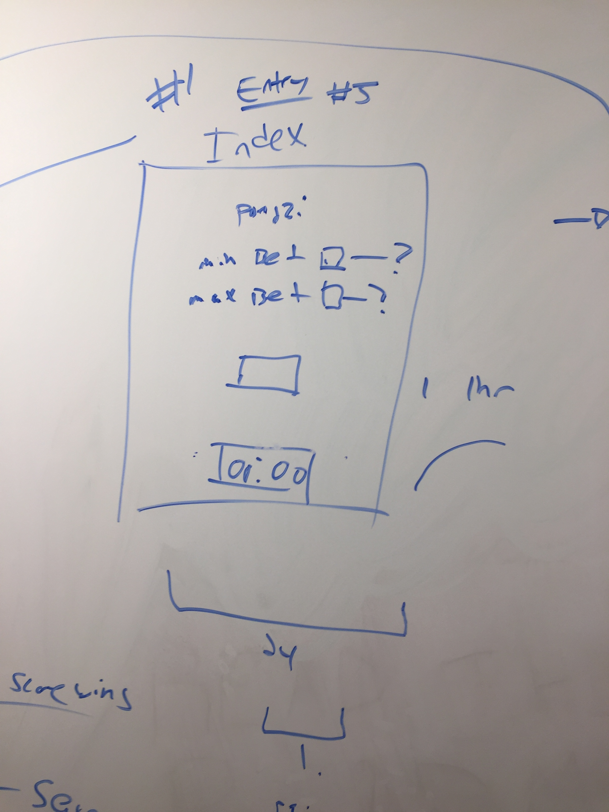
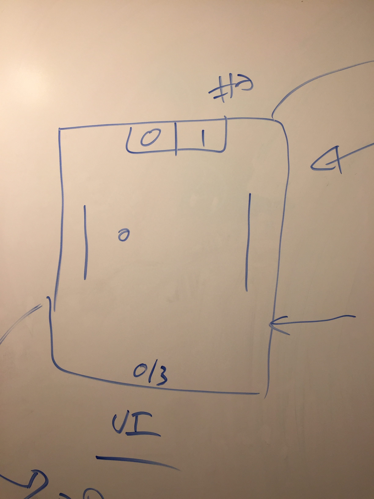

# Pongzi

A pong game "betting" ring. Blockchains, pong, gambling - what could go wrong?

## Dependencies

* [websockets](https://medium.com/@martin.sikora/node-js-websocket-simple-chat-tutorial-2def3a841b61)

## Setup

Install dependencies.

```bash
npm install websocket
```
Start the server.

```bash
clear && node server.js
```

Head to localhost:1337/index.html in the browser to get started!

##  Wireframe
Pongzi has four views aka UIs.  

The first is the betting page.  


The second ui, the game page.  


The third page, the betting page.  


This is the optional bracket ui.  


##  Collaborators

Just a heads up, please do the following:
* Merge to **Dev** First
* **Merge** to Dev First
* Merge **to** Dev First
* Merge to **Dev** First
* Merge to Dev **First**
* Merge to **Dev** First
* ..
* ...
